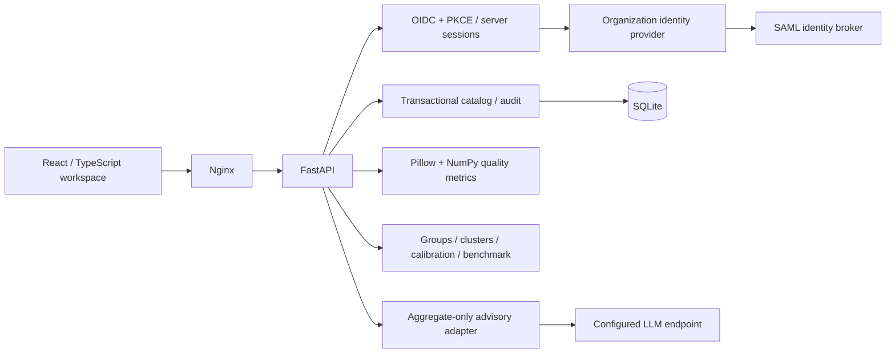

# Image Quality Observatory — Ryan Vo

Current version: `1.0.0`.

A review workspace for computer-vision datasets. Measure blur, exposure and contrast; find recurring failure patterns; label examples; calibrate quality thresholds; and export filtering decisions. Image bytes are decoded in memory and are not retained. SQLite stores metrics, filenames, labels, sessions and audit history.

## Workflows

- Import a batch of images, inspect measured quality and label good/bad examples. Duplicate content within the same batch is idempotent.
- Explore exact failure signatures and deterministic clusters of standardized quality measurements.
- Fit a suggested policy from human labels, compare its training-set confusion matrix, and explicitly apply thresholds as an administrator.
- Run a reproducible synthetic benchmark with separate training and evaluation scenes.
- Export batch decisions as CSV, with spreadsheet formula neutralization.
- Request optional advisory explanations using only aggregate measurements. Core analysis works without an LLM.

## Architecture



Backend responsibilities are separated into configuration, authentication, storage, HTTP routes, metrics, policy, catalog, grouping, calibration, benchmark, export and advisory modules. The browser uses HttpOnly session cookies and obtains a session-bound CSRF token for mutations.

## Local install

Requires Python 3.12 and Node 24. The local demo grants administrator access only on loopback and is refused in production.

```bash
python3.12 -m venv .venv
. .venv/bin/activate
pip install -r backend/requirements.txt
AUTH_MODE=demo COOKIE_SECURE=false APP_ENV=development \
  PYTHONPATH=backend uvicorn app.main:create_app --factory --host 127.0.0.1 --port 8000
```

In another terminal:

```bash
cd frontend
npm ci --ignore-scripts
npm run dev
```

Open **http://127.0.0.1:5173**, enter the local workspace, select images and choose **Measure & import**. Use the same hostname consistently; session cookies are host-scoped. The Vite development proxy forwards `/api` to port 8000.

## Container deployment

```bash
cp .env.example .env
# Configure your actual HTTPS application origin and OIDC provider in .env.
docker compose up --build -d
```

The frontend listens only on host loopback port 8080. Put your HTTPS reverse proxy in front of `127.0.0.1:8080`, preserving the original Host header. Production requires secure cookies and HTTPS identity/callback URLs. The backend has no public port and runs as UID 10001 with a read-only root filesystem; its named volume retains the database. See [deployment and SSO](docs/deployment.md) for identity roles, SAML brokering and backup procedures.

## LLM configuration

Use one credential variable, `LLM_API_KEY`, for the selected provider. `LLM_PROVIDER`, `LLM_MODEL` and optional `LLM_BASE_URL` identify the protocol, model and endpoint; keys alone cannot identify every provider. Leave `LLM_MODEL` empty to keep advice local.

| LLM_PROVIDER | Default base URL | Model selection |
|---|---|---|
| `openai` | `https://api.openai.com/v1` | A chat-completion model available to your account |
| `openai-compatible` | Set `LLM_BASE_URL` including `/v1` | Exposed model ID from your proxy |
| `anthropic` | `https://api.anthropic.com/v1` | Your supported messages model |
| `gemini` | `https://generativelanguage.googleapis.com/v1beta` | Your supported content-generation model |
| `ollama` | `http://127.0.0.1:11434` | A model installed on that Ollama host |

For containers, use a reachable Ollama service address instead of container loopback. Advice has a bounded response size, timeout and output budget. Provider errors fall back to the local summary without exposing provider response bodies. Model text is rendered as text and cannot apply policies or execute tools. Filenames, images, batch names and user identities are excluded from advisory requests.

## AI/ML evaluation

```bash
.venv/bin/python -m pytest -q
cd frontend
npm run build
npm test
```

Backend tests exercise duplicate races, transaction rollback, review workflows, upload bounds, role checks, CSRF, signed OIDC tokens and protocol adapters. Provider tests use mock HTTP transports; they do not prove live provider availability. Browser smoke testing requires the local frontend and backend above:

```bash
.venv/bin/pip install playwright
.venv/bin/playwright install chromium
.venv/bin/python scripts/browser_smoke.py
```

The Analysis screen's **Run synthetic benchmark** generates deterministic scene families and evaluates on held-out scenes. **Suggest policy** reports training-set performance only; it is not a generalization estimate. Quality measurements use a maximum 512-pixel working image, so thresholds should be calibrated for your acquisition conditions. Synthetic performance does not establish accuracy on production images.

## API reference

Interactive OpenAPI is at the backend's `/docs` in local development. The full route and role reference is in [docs/api.md](docs/api.md). Exported CSV contains all decisions in the selected batch, independent of the queue's decision filter. Analytics and exports accept at most 5,000 images per request; select a smaller batch for larger datasets.

## Scope and operations

This application measures technical image quality, not image semantics, safety or annotation correctness. It retains no thumbnails or source images: use the filename and SHA-256 to find originals in your dataset storage. SQLite and one API process suit a single review service; this release does not offer distributed ingestion or automatic database retention. Audit records remain after image metadata deletion. Back up the database and establish an appropriate metadata retention policy for your deployment.

MIT licensed. Built by **Ryan Vo** — [ryandtvo@gmail.com](mailto:ryandtvo@gmail.com).
